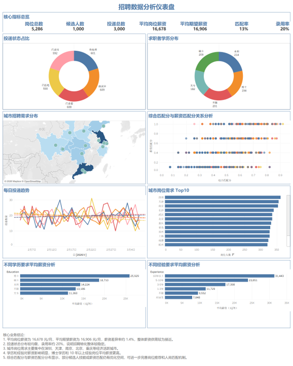

# 招聘市场供需与人岗匹配分析
## 一、项目背景

本项目基于招聘岗位表、候选人表和投递记录表，围绕岗位需求、求职者画像、投递状态、人岗匹配情况和薪资供需关系进行分析，利用 Excel 和 Tableau Public 完成数据清洗、指标构建和可视化仪表盘制作，并结合分析结果提出招聘优化建议。

## 二、分析目标

1. 分析招聘岗位总量、候选人数、投递数量等核心指标；
2. 分析投递状态分布，观察招聘流程转化情况；
3. 分析求职者学历结构，了解候选人画像；
4. 分析城市招聘需求分布，判断岗位集中区域；
5. 分析综合匹配分与薪资匹配分之间的关系；
6. 分析学历、经验对岗位平均薪资的影响；
7. 根据分析结果提出招聘运营优化建议。

## 三、核心指标

| 指标 | 数值 |
|---|---:|
| 岗位总数 | 5,286 |
| 候选人数 | 1,000 |
| 投递总数 | 3,000 |
| 平均岗位薪资 | 16,678 元/月 |
| 平均期望薪资 | 16,906 元/月 |
| 匹配率 | 13% |
| 录用率 | 20% |

## 四、可视化仪表盘

本项目使用 Tableau Public 制作招聘数据分析仪表盘，主要展示岗位总数、候选人数、投递总数、平均岗位薪资、平均期望薪资、匹配率、录用率等核心指标，并从投递状态、求职者学历、城市招聘需求、人岗匹配关系、投递趋势、学历薪资和经验薪资等角度进行分析。



Tableau Public 在线地址：这里粘贴你的 Tableau Public 链接

## 五、核心业务结论

1. 平均岗位薪资为 16,678 元/月，平均期望薪资为 16,906 元/月，薪资差异率约为 1.4%，说明整体薪资供需较为接近。
2. 投递状态分布较均衡，录用率约为 20%，说明招聘流程整体较稳定。
3. 城市招聘需求主要集中在深圳、天津、南京、北京、重庆等经济活跃城市。
4. 学历和经验对薪资影响明显，博士学历和 10 年以上经验岗位平均薪资更高。
5. 综合匹配分与薪资匹配分分布显示，部分候选人在技能、薪资或岗位匹配方面仍有优化空间，后续可进一步完善岗位推荐和人岗匹配机制。

## 六、项目文件结构

```text
02_招聘市场供需与人岗匹配分析
├── data
│   ├── applications.csv
│   ├── candidates.csv
│   └── jobs.csv
├── dashboard
│   └── 招聘市场供需与人岗匹配分析仪表盘.png
├── report
│   └── 业务分析报告.md
└── README.md
