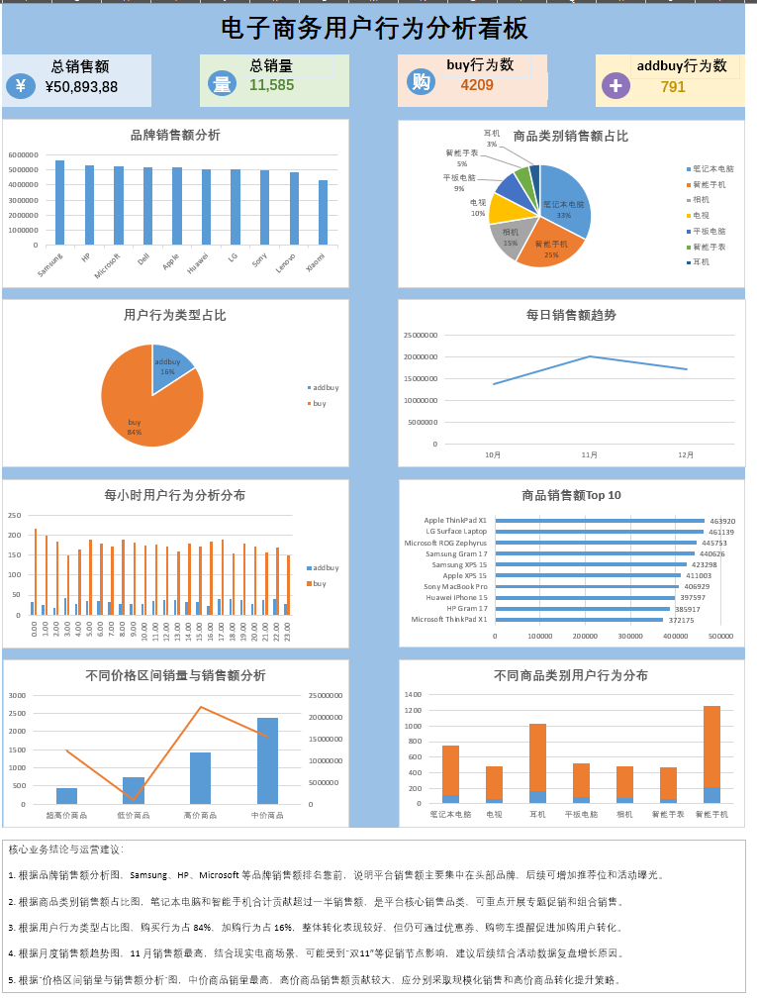

# Data-Analysis-Projects

本仓库用于整理个人数据分析与可视化项目，项目内容涵盖电商用户行为分析、销售分析、物流分析、SQL 数据分析等方向。

每个项目将尽量包含：数据来源、数据清洗过程、指标构建、可视化看板、业务分析结论和优化建议。

## 项目列表

| 序号 | 项目名称 | 工具 | 项目说明 |
|---|---|---|---|
| 01 | [电子商务用户行为分析](./01_电子商务用户行为分析) | Excel / 数据透视表 / 可视化看板 | 分析用户购买行为、品牌销售、商品类别、价格区间和时间趋势 |

## 当前项目展示

### 01_电子商务用户行为分析

本项目基于公开电商数据集，使用 Excel 完成数据清洗、指标构建、数据透视分析和可视化看板制作，并结合业务场景提出运营优化建议。

